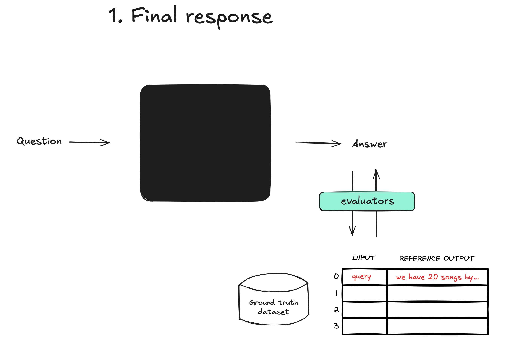

# Evaluations

In these modules, we'll utilize LangSmith to evaluate our multi-agent built in the Multi-Agent modules. We'll be utilizng the full assistant we created in ```memory-assistant.ts```.

LangSmith provides powerful tools to benchmark your applications performance - in these modules we will explore evaluations.

**Evaluations** are a quantitative way to measure performance of agents, which is important beacause LLMs don't always behave precitably — small changes in prompts, models, or inputs can significantly impact results. Evaluations provide a structured way to identify failures, compare changes across different versions of your applicaiton, and build more reliable AI applications.

## Module 1: Final Answer Evaluations

This module is the ```evals/final-answer.ts``` file. It covers how to benchmark your application's final answer by running your agent end-to-end over a ground truth dataset.


## Module 2: Single Step Evaluation

This module is the ```evals/single-step.ts``` file. It covers how to unit test your application, explaining how to systematically evaluate each individual component of your agent.


## Module 3: Trajectory Evaluation

This module is the ```evals/trajectory.ts``` file. In this module, we'll see how to evaluate if your agent takes the right steps, in the **right order** to solve a given problem. 
